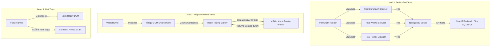
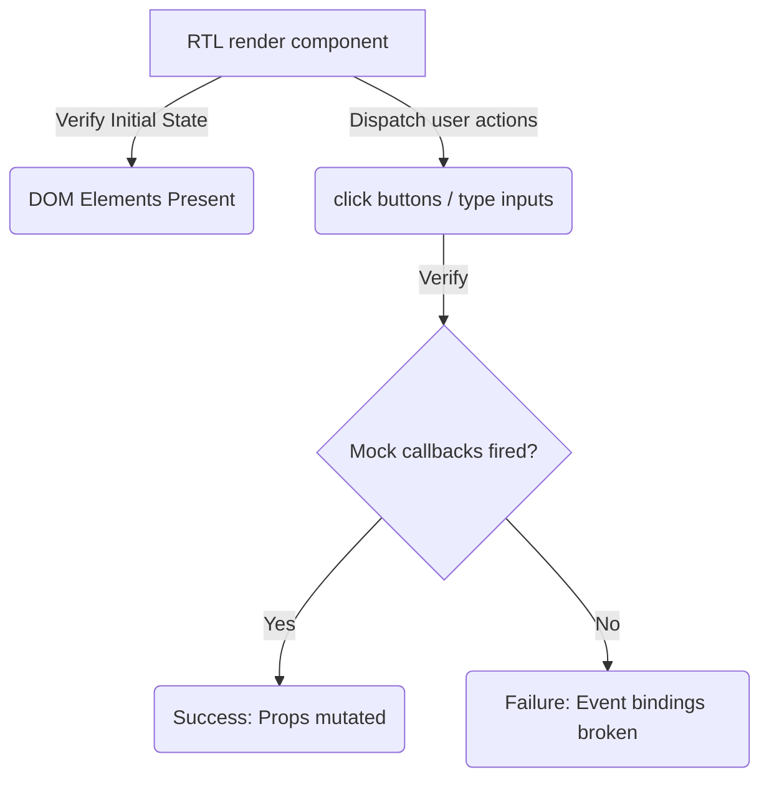
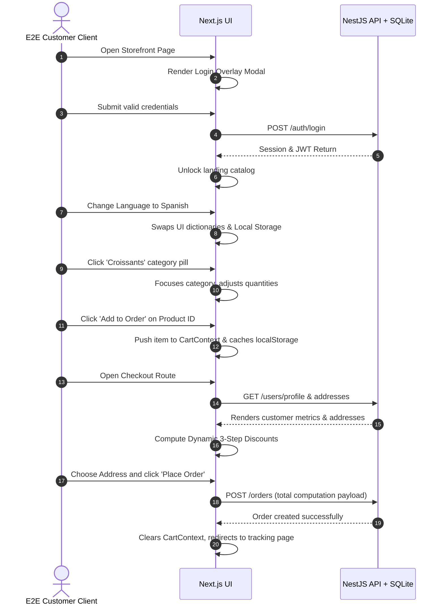

# Frontend Testing Roadmap & Strategy

This document details the comprehensive testing strategy, directory layout, tooling, and specific test plans for every single module in the client-side Next.js frontend application.

> [!IMPORTANT]
> The frontend is built on **Next.js 16 (App Router)** and **React 19**, communicating with a **NestJS** backend. Testing must be configured using modern, blazing-fast tools that fully support ESM (ECMAScript Modules) and React 19's rendering paradigms.

---

## 1. Architectural Strategy

The testing architecture is divided into three isolated levels, each serving a specific confidence and speed objective:



### Level 1: Unit Testing
*   **Target**: Pure javascript utilities, translation dictionaries, custom hooks, and isolated state contexts.
*   **Tools**: `Vitest` + `Happy DOM` (or `jsdom`).
*   **Objective**: Ensure core algorithmic calculations (e.g., dynamic multi-tier discount combinations in `CartContext`, fallback profile properties in `AuthContext`) execute correctly without mocking overhead.

### Level 2: Component Integration Testing
*   **Target**: Forms, sidebars, interactive components, and standard page templates.
*   **Tools**: `Vitest` + `React Testing Library (RTL)` + `@testing-library/jest-dom` + `Mock Service Worker (MSW) v2`.
*   **Objective**: Test client interactions, state bindings, input form validations, and asynchronous lifecycle state changes (Loading -> Data -> Error) by mocking network requests at the fetch boundary.

### Level 3: End-to-End (E2E) Workflow Testing
*   **Target**: Complex, multi-page business journeys, route middleware guards, live map tracking, and file uploads.
*   **Tools**: `Playwright`.
*   **Objective**: Emulate physical user behavior in real, headless browsers. Test exact workflows across different roles (`client`, `admin`, `delivery`, `produccion`), cookie-based sessions, and geo-tracking features.

---

## 2. Testing Stack & Setup Configuration

### 2.1 Dependencies to Install
To bootstrap this environment, the following devDependencies must be added to `frontend/package.json`:

```json
"devDependencies": {
  "vitest": "^1.6.0",
  "@vitejs/plugin-react": "^4.3.0",
  "jsdom": "^24.1.0",
  "@testing-library/react": "^16.0.0",
  "@testing-library/jest-dom": "^6.4.0",
  "@testing-library/user-event": "^14.5.0",
  "msw": "^2.3.0",
  "@playwright/test": "^1.44.0"
}
```

### 2.2 Test Directory Structure
Tests are co-located alongside the components to maximize maintainability, with E2E tests residing in their own root-level directory:

```
/frontend
  ├── app/                        # Next.js Pages & Routes
  │   ├── page.tsx
  │   ├── page.test.tsx           # Integration page test
  │   ├── catalog/
  │   │   └── [id]/
  │   │       ├── page.tsx
  │   │       └── page.test.tsx
  │   └── ...
  ├── components/                 # UI components
  │   ├── auth/
  │   │   ├── LoginForm.tsx
  │   │   └── LoginForm.test.tsx  # Co-located component test
  │   └── ...
  ├── context/                    # Shared context states
  │   ├── CartContext.tsx
  │   └── CartContext.test.tsx    # State logic unit test
  ├── hooks/                      # Custom React Hooks
  │   ├── useApiCall.ts
  │   └── useApiCall.test.ts
  ├── lib/                        # Core SDKs, APIs, and i18n
  │   ├── api.ts
  │   ├── api.test.ts
  │   └── ...
  ├── e2e/                        # Playwright End-to-End Tests
  │   ├── auth-customer.spec.ts   # E2E Guest & Customer checkout flow
  │   ├── admin-crud.spec.ts      # E2E Administrator products/categories CRUD
  │   ├── delivery-map.spec.ts    # E2E Delivery driver live coordinates
  │   └── production.spec.ts      # E2E Baker production queue
  ├── vitest.config.ts            # Vitest config file
  └── playwright.config.ts        # Playwright config file
```

---

## 3. Detailed Testing Roadmaps for Every Module

Here is the exhaustive list of specific tests to write for **every single module and file** in the frontend source code.

### 3.1 Global Contexts & State Management (`frontend/context/`)

This suite tests global React state, localStorage persistence, and fallback logic under `jsdom` environments.

| Module | Purpose | Test Cases to Write |
| :--- | :--- | :--- |
| **`AuthContext.tsx`** | Client session and profile state | 1. **Initial State**: Verify it starts with `isLoading: true`, `user: null`, `session: null`, and `profile: null`. <br>2. **Session Restoration**: Mock `localStorage` with a valid session payload. Assert that on mount it parses the token, updates states, and initiates a background fetch to `/users/:userId`. <br>3. **Manual Session Updates**: Mount the provider. Invoke `updateLocalSession` with mock data. Verify that `localStorage` is written to, local state properties change immediately, and the backend user profile details are fetched.<br>4. **Sign Out**: Initialize with valid session states. Call `signOut`. Assert that states are set to `null` and the localStorage session is removed.<br>5. **Profile Query Fallbacks**: Mock `/users/:userId` endpoint to return 500 error. Call `fetchUserProfile` and verify it falls back gracefully to `user_metadata` without crashing. |
| **`CartContext.tsx`** | Customer Cart State & Rules | 1. **Add Items**: Verify adding a product details payload creates a cart item with exact quantity and price. Add same item again and verify quantity increments.<br>2. **Remove & Update**: Test modifying quantity manually and removing items entirely. Assert that updating quantity to `0` automatically deletes the entry.<br>3. **User Isolation**: Verify cart cache keys depend on user profile ID (`jhoanes-cart-{profile.id}`) to ensure dynamic carts are kept completely isolated when switching users.<br>4. **3-Step Pricing Calculations**: *(CRITICAL)*<br>&nbsp;&nbsp;&nbsp;&nbsp;• **Step 1 (Product Specific Discount)**: Setup product item with specific discount percentages or special fixed price overrides in the profile structure. Assert that item price resolves to the special price.<br>&nbsp;&nbsp;&nbsp;&nbsp;• **Step 2 (General Discount)**: Apply a general user discount percentage (e.g. 10%) on the profile. Assert that the cart subtotal is reduced correctly after Step 1 is applied.<br>&nbsp;&nbsp;&nbsp;&nbsp;• **Step 3 (Delivery Fee)**: Inject a specific delivery fee onto the profile. Assert that `getFinalTotal` equals `(Step 2 result) + Delivery Fee`. |
| **`LanguageContext.tsx`** | Internationalization engine | 1. **Default Boot**: Verify it boots with the stored locale in `localStorage`, defaulting to `'en'` if empty.<br>2. **State Updates**: Change locale to `'es'`. Verify `localStorage` writes the change, translation keys reload Spanish files (`es.ts`), and the context provider emits the update.<br>3. **Admin Setting**: Test `setDefaultLocale`. Verify it stores the admin default, updates the local user preference, and reloads localized strings immediately across the UI. |

---

### 3.2 Custom Hooks & Core Libraries (`frontend/hooks/` & `frontend/lib/`)

These files contain core SDK wrappers, translations dictionaries, and state handlers.

| Module | Purpose | Test Cases to Write |
| :--- | :--- | :--- |
| **`useApiCall.ts`** | Consolidates fetch lifecycles | 1. **Immediate Execution**: Mount the hook with a mock resolving promise. Verify that on mount, `loading` starts as `true`, resolves to `false`, and `data` contains the resolved value.<br>2. **Manual Trigger**: Set `immediate = false`. Verify state remains idle. Call the `execute` callback. Assert loading state triggers, resolves, and fills data.<br>3. **Error Handling**: Setup API call to throw. Verify `error` state is populated with the matching message, and `loading` settles back to `false`. |
| **`api.ts`** | HTTP Network wrapper | 1. **Endpoint Resolution**: Mock standard `fetch`. Execute `get('/products')` and verify call redirects to `${process.env.NEXT_PUBLIC_API_URL}/products`.<br>2. **Payload Serializing**: Execute `post('/auth/login', body)`. Verify payload matches JSON standard headers (`Content-Type: application/json`) and serialized body is transmitted.<br>3. **Non-2xx Response Parsing**: Mock backend response with 401 Unauthorized status. Verify `api` parses JSON error messages and throws an explicit `Error` container.<br>4. **Empty Responses Handling**: Mock backend with 204 No Content (empty string). Verify it handles parsing gracefully and returns empty object `{}`. |
| **`products.ts`** | Fallback offline products | 1. **Data Integrity**: Verify that `PRODUCTS` array contains static fallback products matching exact types (id, name, category, price, description, relative image link). |
| **`supabase.ts`** | Supabase authentication client | 1. **Initialization**: Verify Supabase client triggers and configures correctly using public environmental keys. |
| **`en.ts` / `es.ts`** | UI translations dictionaries | 1. **Keys Alignment**: Write a utility script test to ensure every dictionary translation key in `en.ts` has an identical mapping key in `es.ts` to prevent runtime dictionary rendering gaps. |

---

### 3.3 Shared Presentation Components (`frontend/components/`)

These components must be tested inside React Testing Library (RTL) for rendering correctness, firing callbacks, and localized text bindings.



#### Shared Components Sub-Directory: `auth`
*   **`LoginForm.tsx`**
    1.  **Validation**: Verify that submitting empty or malformed inputs shows validation alerts.
    2.  **Submit Events**: Verify that clicking login triggers the callback prop with credentials.
    3.  **Loading Controls**: Verify inputs and buttons are disabled when loading state is active.
*   **`RegisterForm.tsx`**
    1.  **Fields Layout**: Verify all signup fields (first name, last name, phone, email, password, address) are rendered correctly.
    2.  **Submitting Fields**: Verify clicking register aggregates all fields into a valid unified registration payload and dispatches it correctly.

#### Shared Components Sub-Directory: `catalog`
*   **`CatalogHeader.tsx`**
    1.  **Header Titles**: Verify it displays heading, active category subtitle, and total product counts correctly.
*   **`CategoryFilters.tsx`**
    1.  **Active Highlighting**: Verify active category pill is highlighted.
    2.  **Filter Swapping**: Verify clicking a category pill triggers the filter selection callback.
*   **`ProductCard.tsx`**
    1.  **Visual Elements**: Verify title, formatted price, description, and dynamic discounts are printed correctly.
    2.  **Image Error Handling**: Verify that if the image URL fails to load, the standard backup placeholder image (Unsplash link) is substituted.
    3.  **Enforce Min Quantity Constraints**: Verify that if `product.category_min_qty > 1`, a warning badge is displayed, and the increment/decrement bounds start at that specific number.
    4.  **Quantity Counter**: Test clicking `+` and `-` buttons. Assert that counter modifies but never dips below the configured minimum quantity constraint.
    5.  **Cart Insertion**: Verify clicking "Add to Order" fires the callback with the correct quantity.
*   **`ProductCardCompact.tsx`**
    1.  **Compact Grid Layout**: Verify that basic product elements, smaller image, and compact cart controls render without breaking in compressed layouts.

#### Shared Components Sub-Directory: `layout`
*   **`Navbar.tsx`**
    1.  **Rendering Elements**: Verify logo, store links, dynamic cart icon count, profile settings dropdown, and language switcher render correctly.
    2.  **Guest Actions**: Verify that when the user is not authenticated, "Sign In" and "Create Account" buttons are visible.
    3.  **Client/Staff Actions**: Verify that when logged in, it renders profile dropdown options tailored to their respective roles (`admin`, `delivery`, `produccion`, `client`).
*   **`AdminSidebar.tsx`**
    1.  **Active Route Styling**: Verify the active page path highlights matching navigation items.
    2.  **Administration Routes**: Verify sidebar contains links to Products, Categories, Orders, Customers, Zones, maps, and reports.
*   **`DeliverySidebar.tsx`**
    1.  **Driver Routes**: Verify sidebar contains assignment delivery queues, maps trackers, and toggles for status.
*   **`ProduccionSidebar.tsx`**
    1.  **Bakery Routes**: Verify sidebar contains bakery schedule queue links and operational report links.

#### Shared Components Sub-Directory: `ui`
*   **`DevTools.tsx`**
    1.  **Environment Gatekeeping**: Verify devtools are visible ONLY in development and hidden in production environments.
    2.  **Database Seeding Utilities**: Verify clicking seeding triggers (Wipe DB, Mock seed) fires API calls to backend devtools controllers.
*   **`LanguageSwitcher.tsx`**
    1.  **Locale Toggles**: Verify clicking the current flag displays options to swap, and clicking a language correctly triggers `setLocale`.

---

### 3.4 Page Components & Routes (`frontend/app/`)

These integration tests verify page lifecycles, backend responses (mocked via MSW), router parameters parsing, and data submissions.

#### 3.4.1 General Storefront & Guest Pages
*   **`app/page.tsx` (Main Landing Storefront)**
    1.  **Product Fetching**: Assert that on render, a GET request is dispatched to `/products`. Verify products load and display correctly.
    2.  **Authentication Gatekeeper Modal**: Verify that when auth resolves to `user: null`, the full-screen dynamic login overlay modal is displayed and blocks interaction with the background.
    3.  **Storefront Search**: Type into search input. Assert that the list of displayed products is immediately filtered by name and category matching.
    4.  **Category Sorting**: Click category pills. Verify dynamic carousels filter, slide, and focus correct product groups.
*   **`app/auth/login/page.tsx` (Login page)**
    1.  **Login Submission**: Mock `/auth/login` to return standard session object. Submit credentials, verify state updates, and check redirection to corresponding role page (`/admin`, `/produccion`, `/delivery`, or storefront `/`).
*   **`app/auth/register/page.tsx` (Signup page)**
    1.  **Signup Submission**: Verify that filling out the registration details calls the register API, shows a success message, and redirects to the sign-in/catalog section.
*   **`app/auth/forgot-password/page.tsx` (Password recovery)**
    1.  **Recovery Email**: Verify typing an email triggers an API recovery request, and renders a localized check-email notification.
*   **`app/catalog/[id]/page.tsx` (Product Detail View)**
    1.  **Fetch Product**: Verify it reads route parameter `[id]` and requests `/products/:id`. Renders details (prices, categories, descriptions, images).
*   **`app/catalog/category/[category]/page.tsx` (Category Landing)**
    1.  **Filtered Category List**: Verify only products corresponding to the category parameters are requested and displayed.

#### 3.4.2 Customer Authenticated Pages
*   **`app/checkout/page.tsx` (Checkout workflow)**
    1.  **Cart Contents**: Verify items loaded from `CartContext` are listed.
    2.  **Discounts & Totals Summary**: Confirm subtotal, product-specific discounts, general discount, shipping fees, and absolute totals are displayed.
    3.  **Address Selector**: Verify profile addresses list in dropdowns. Ensure user can select the destination address.
    4.  **Order Placement Flow**: Mock POST `/orders` endpoint to return success. Click "Place Order". Verify `/orders` receives full payload (items, quantities, totals, selected address) and `clearCart()` is invoked. Redirection to `/orders` triggers.
*   **`app/profile/page.tsx` (Profile Manager)**
    1.  **Profile Update**: Render user properties. Type updates (first name, phone, password). Submit and verify PATCH `/users/:userId` fires and triggers profile refresh.
*   **`app/profile/addresses/page.tsx` (Address list)**
    1.  **List & Delete**: Render list of shipping/billing locations. Mock DELETE address endpoint. Verify clicking delete triggers the API request and updates the UI list.
*   **`app/profile/addresses/new/page.tsx` (Add Address)**
    1.  **Geographic Selections**: Test inputting address properties, coordinates, map pin markers, and clicking submit. Verify correct POST to save address.
*   **`app/orders/page.tsx` (Orders history)**
    1.  **Orders List**: Fetch customer specific orders from `/orders/customer`. Confirm rendering of orders list including dates, statuses, and total amounts.
*   **`app/orders/[id]/page.tsx` (Order tracker)**
    1.  **Order Status Tracker**: Fetch single order by parameter. Renders progress bar, item details, delivery instructions, and chronological audit log notes.

#### 3.4.3 Delivery Driver Pages
*   **`app/delivery/page.tsx` (Assignments dashboard)**
    1.  **Assignment Queues**: Load assigned orders from backend. Display order address, fulfillment details, and actions.
    2.  **Status State Machines**: Test clicking "Start Delivery". Verify status updates to "In Transit" via PATCH to backend. Test clicking "Deliver" to update status to "Delivered".
*   **`app/delivery/settings/page.tsx` (Driver settings)**
    1.  **Status Controls**: Verify toggling offline/online status updates driver availability parameters in the database.
*   **`app/map/page.tsx` (Realtime Map View)**
    1.  **Google Maps Render**: Verify initialization of Google Maps API script and map canvas rendering. Ensure coordinates translate to live driver pins.

#### 3.4.4 Production (Bakery) Pages
*   **`app/produccion/page.tsx` (Bakery kitchen dashboard)**
    1.  **Production Batches**: Verify order items are aggregated and displayed grouped by status (Pending, Baking, Completed).
    2.  **Status Mutations**: Confirm clicking update transitions item status and synchronizes the queue.
*   **`app/produccion/settings/page.tsx` (Production parameters)**
    1.  **Scheduler Settings**: Test adjusting default preparation times, baker queues, and parameters.
*   **`app/produccion/reports/page.tsx` (Production volume reports)**
    1.  **Batch Summaries**: Verify volume calculation engines parse batches, listing raw ingredient volumes and category volumes.

#### 3.4.5 Operations & Admin Pages
*   **`app/admin/page.tsx` (Main Administrative Dashboard)**
    1.  **Analytical Reports metrics**: Verify it fetches financial aggregates and volumes (sales, pending orders, user counts). Displays charts and figures.
*   **`app/admin/products/page.tsx` (Products management CRUD)**
    1.  **List & Search**: Verify catalog lists with search and filter features.
    2.  **Interactive Editor Modals**: Test opening "New Product" modal, filling properties, uploading images, and submitting. Verify POST request triggers. Same for updates and deletions.
*   **`app/admin/productos2/page.tsx` (Alternative products manager)**
    1.  **Sync Operations**: Verify alternative layouts and batch database operations.
*   **`app/admin/categories/page.tsx` (Category settings)**
    1.  **Category Manager**: CRUD operations on product categories. Test editing minimum order quantities per category.
*   **`app/admin/orders/page.tsx` (Orders control panel)**
    1.  **Global Order Control**: Lists all orders. Admin filters orders by status, dates, and driver.
    2.  **Note updates & Audits**: Test entering manual notes. Verify notes are written to the order notes timeline in backend sqlite.
*   **`app/admin/users/page.tsx` (Users configuration)**
    1.  **Accounts & Roles Control**: Lists system users. Admin updates roles (`client`, `admin`, `delivery`, `produccion`) and verify database updates.
*   **`app/admin/clients/page.tsx` (Customer segments & special rules)**
    1.  **Discounts Setup**: Select customer. Adjust customized dynamic discounts (e.g., product-specific discount percentage or custom fixed price, general discount percentage, custom delivery fee). Verify parameters submit to database schemas.
*   **`app/admin/zones/page.tsx` (Delivery Zones Map)**
    1.  **Geofenced Zones**: Draw distribution borders on coordinate overlays. Validate geofence schemas.
*   **`app/admin/routes/page.tsx` (Delivery routing)**
    1.  **Routes Management**: Map sequences of coordinates for optimal route scheduling.
*   **`app/admin/notifications/page.tsx` (Alert logs)**
    1.  **Logs Alerts**: Verify sending and auditing system-wide alert notifications.
*   **`app/admin/settings/page.tsx` (Admin parameters parameters)**
    1.  **Parameter Setup**: Test editing store parameters, tax structures, and support contacts.
*   **`app/admin/reports/page.tsx` (Advanced analytics graphs)**
    1.  **Volumetric breakdowns**: Check rendering of analytical data visual charts.

---

## 4. End-to-End (E2E) Workflows Test Cases (`frontend/e2e/`)

Playwright E2E tests target cross-module system integration, mimicking authentic users interacting with the full application.



### 4.1 Customer E2E Journeys (`auth-customer.spec.ts`)
*   **Scenario 1: Authentication Gatekeeper & Session Recovery**
    1.  Navigate to `/`.
    2.  Verify authentication modal overlay is visible and block interactions.
    3.  Input valid customer credentials. Click "Sign In".
    4.  Assert catalog unlocks, modal closes, and dynamic greeting appears with first name.
    5.  Reload browser. Verify session automatically recovers from cache and catalog remains unlocked.
*   **Scenario 2: Internationalization Alignment**
    1.  Locate language switcher dropdown on navbar.
    2.  Switch language to English (`'en'`), then Spanish (`'es'`).
    3.  Confirm headings, alert boxes, and buttons immediately translate without page refresh.
*   **Scenario 3: Add to Cart & Price Discount Rules**
    1.  Verify dynamic prices on product cards. If user has active custom discounts, confirm discounted prices are displayed next to strikethrough original prices.
    2.  Add a product to the cart with quantity matching the minimum quantity constraint.
    3.  Verify cart badge increments instantly on the navbar.
*   **Scenario 4: Complete Checkout Lifecycle**
    1.  Click the cart icon to navigate to `/checkout`.
    2.  Confirm product list, dynamic discount subtotal calculations, and shipping fee matching the profile config.
    3.  Select a valid shipping address from the registered address dropdown.
    4.  Click "Place Order".
    5.  Assert modal success triggers, cart state is wiped clean, and browser redirects to `/orders/[id]`.

### 4.2 Admin E2E Workflows (`admin-crud.spec.ts`)
*   **Scenario 1: Authenticated Admin Routing Middleware**
    1.  Login as a user with `'client'` role. Attempt to navigate directly to `/admin`.
    2.  Assert route middleware redirects client to `/` storefront.
    3.  Sign out. Login as a user with `'admin'` role.
    4.  Assert browser successfully lands and remains on `/admin` dashboard.
*   **Scenario 2: Dynamic Products CRUD & Bulk Imports**
    1.  Navigate to `/admin/products`.
    2.  Click "Add Product". Fill form details, upload image file, click submit.
    3.  Assert new product instantly loads on table list.
    4.  Edit the product price, submit, and confirm changes persist.
    5.  Delete the product, verify prompt alert, click delete, and verify removal from table.
*   **Scenario 3: Categories & Constraints management**
    1.  Navigate to `/admin/categories`.
    2.  Locate a category, click edit, and modify the `minimum quantity constraint` (e.g., set to 12).
    3.  Sign out and login as a customer. Verify that this specific category products now mandate a starting count of 12 on the storefront.

### 4.3 Production Queue Operations (`production.spec.ts`)
*   **Scenario 1: Kitchen Queue Synchronization**
    1.  Login as a user with `'produccion'` role. Verify redirections to `/produccion`.
    2.  Review baking queue list.
    3.  Click "Start Baking" on a pending queue batch.
    4.  Verify status transitions visually on-screen and calls API state machines in NestJS.
    5.  Mark batch as "Ready", verify aggregation summaries update, and batch archives.

### 4.4 Delivery Driver Live Operations (`delivery-map.spec.ts`)
*   **Scenario 1: Driver Assignment & Tracking Status**
    1.  Login as `'delivery'` driver.
    2.  Navigate to `/delivery`. Confirm list of assignments.
    3.  Click "Start Transit". Renders tracking map route.
    4.  Simulate device geolocations coordinate change. Confirm live update transmissions.
    5.  Click "Delivered". Verify order completes, notes log aggregates the audit note, and assignment is archived.

---

## 5. Execution & Validation Scripts

To integrate this plan into standard developer routines, the following script shortcuts must be registered in the root `package.json` or `frontend/package.json`:

```json
"scripts": {
  "test:unit": "vitest run",
  "test:unit:watch": "vitest",
  "test:unit:coverage": "vitest run --coverage",
  "test:e2e": "playwright test",
  "test:e2e:ui": "playwright test --ui"
}
```

### 5.1 Coverage Metrics Targets
The testing infrastructure should be audited against the following core performance coverage targets:

*   **Statements & Branches Coverage**: Minimum **80%** across global context modules (`CartContext`, `AuthContext`) and custom utility hook wrappers.
*   **Smoke Validation**: Zero compile-time or testing framework-level execution failures during sequential local checkruns.
*   **E2E Complete Journeys**: 100% of the critical order fulfillment pipeline (customer login -> add to cart -> checkout -> production baking queue -> delivery transit -> complete order) must execute successfully without database lockups.
